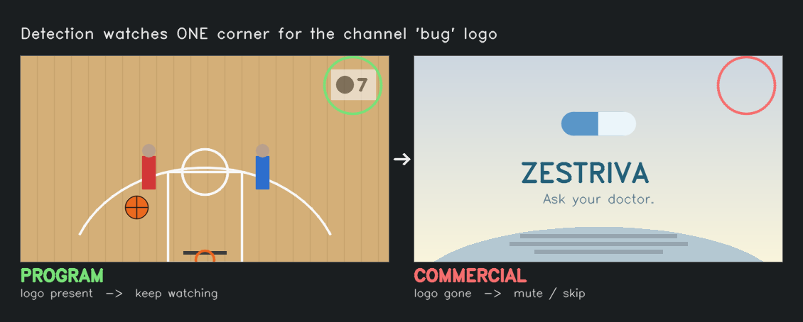

# The Clicker

Automatically mutes (or fast forwards through) commercial breaks on live or "taped" sports. Works on any broadcast that keeps a network "bug" logo in the corner during programming. This project watches the video feed for a consistent logo and color profile, and fast forwards or mutes during segments that differ significantly from the content you're watching.

> AI Disclaimer: This project was heavily vibe coded with Claude Code. It was delightful to be able to go from 0 to "Changes the Way I Watch Sports" in just a few hours.
>Heads up: this is a hobby project, not a polished appliance. Expect to spend an evening on hardware + calibration, and to tweak a few numbers for your own setup and channels. This README is the practical guide.

**TL;DR on how my personal setup works:** 
* an HDMI splitter sends a copy of the Apple TV's video to a USB capture card on a linux box
* screenshots from the video are checked for the channel's corner logo (present during the game, gone during ads) and/or color profile (lots of hardwood color for basketball games, grass color for football, etc)
* When the logo disappears it **mutes my soundbar** (live viewing) or **skips forward** (delayed viewing) until the right profile (logo + color profile) comes back

That's it! I messed around with training a model but found the simple threshold based setup easier to use.



*Checks whether that corner logo is **present** (show) or **absent** (commercial) and whether the content's color profile matches the game content.*

**Not on an Apple TV?** The only piece that's Apple TV specific is *how it takes actions* (mute / skip), which lives behind a small `PlaybackController` interface you can implement for another device. See [Using a different playback device](#using-a-different-playback-device).

---

## 1. What you need (hardware)

| Part | What it does | Example | Approx. |
|---|---|---|---|
| **HDMI splitter (1×2)** | Sends the playback device's picture to *both* your TV and the capture card at once | [OREI HD-102](https://www.amazon.com/dp/B005HXFARS) | ~$25 |
| **USB 3.0 HDMI capture card** | Turns HDMI into a USB webcam style video device the computer can read | [Rybozen 4K USB 3.0 capture card](https://www.amazon.com/dp/B097DKNS1M) | ~$20 |
| **A small always on Linux box** | Runs the software 24/7 | Raspberry Pi 4/5, a mini PC, or a Proxmox LXC | varies |
| 2× short HDMI cables + 1 USB 3.0 cable | Wiring | - | - |

Any generic "USB 3.0 HDMI capture card" works. They're typically UVC devices Linux recognizes with no driver. The compute box can be anything that runs Python + OpenCV, such as a Raspberry Pi 4/5. I'm using a little Thinkcentre running proxmox.

---

## 2. How it's wired

```
                         ┌─────────────┐
                         │  HDMI 1x2   │  out 1 ─────────► your TV (normal viewing)
   Apple TV ──HDMI──────►│  splitter   │
                         │ (OREI 102)  │  out 2 ─────────► USB capture card
                         └─────────────┘                        │
                                                              USB 3.0
                                                                │
                                                                ▼
                                                       Linux box (this software)
                                                       also needs to reach the
                                                         Apple TV over your network
```

- **Output 1 → TV**: what you actually watch. Untouched.
- **Output 2 → capture card → computer**: the copy the software analyzes.
- The computer also talks to the Apple TV over your LAN (to mute/skip), so it must be on the same network/VLAN as the Apple TV.

---

## 3. Install

Works on any Debian family system with systemd. A **Raspberry Pi** (Raspberry Pi OS), a Debian/Ubuntu machine, or a Proxmox LXC container should work fine.

1. **Plug the capture card** into a USB 3.0 port and confirm the OS sees it:
   ```bash
   ls /dev/video*          # expect /dev/video0
   v4l2-ctl --list-devices
   ```
2. **Clone and run the installer** as root:
   ```bash
   sudo git clone https://github.com/michigandrew/the-clicker.git /opt/the-clicker
   cd /opt/the-clicker
   sudo bash deploy/setup.sh
   ```
   It installs dependencies into a venv, installs a `the-clicker` systemd service (starts on boot), and sanity checks the capture device. The dashboard comes up on port **8080**.

> Prefer to skip systemd and run it by hand? `pip install -r requirements.txt` then `python3 server.py`. Pairing, calibration, and the dashboard are identical.

### Updating later

Your calibrations (`profiles/`), Apple TV pairing (`credentials.json`), and the Python `venv/` are all ignored by git, so updating does not touch them. To pull a newer version:

```bash
cd /opt/the-clicker
git pull
source venv/bin/activate && pip install -r requirements.txt
sudo systemctl restart the-clicker
```

Tip: set your Apple TV ID with the `APPLE_TV_ID` environment variable instead of editing `config.py`. That keeps `config.py` unchanged, so `git pull` never hits a conflict. If you did edit `config.py` and a pull complains, run `git stash`, then `git pull`, then `git stash pop` and reapply your values.

---

## 4. Connect to your Apple TV

The software controls the Apple TV with [pyatv](https://pyatv.dev/) over the network.

1. **Find your Apple TV's ID.** On the box (venv active):
   ```bash
   atvremote scan
   ```
   Copy the `Identifier` for your Apple TV.
2. **Set it.** Either edit `APPLE_TV_ID` in [`config.py`](config.py), or set the `APPLE_TV_ID` environment variable.
3. **Pair** (one time. A PIN appears on the TV):
   ```bash
   cd /opt/the-clicker && source venv/bin/activate && python3 pair.py
   ```
   This saves `credentials.json` (ignored by git since it's machine specific and contains your pairing keys).

### Volume control is specific to your setup
My muting works by spamming the Apple TV's `volume_down` (and `volume_up` to restore) via pyatv. The defaults (`MUTE_STEPS`, `UNMUTE_STEPS` in `config.py`) are tuned so 10 presses fully mutes and 7 restores a normal level. You'll likely need to mess around with these settings to figure out what works for you.

### Using a different playback device
The included control backend is for Apple TV (via pyatv), selected by `CONTROLLER_BACKEND="appletv"` in `config.py`. I haven't tried, but I imagine it's possible to drive another device in a similar way (a CEC controlled TV/soundbar, a Roku, a Fire TV, an IR blaster, …):

1. In `intervention.py`, subclass `PlaybackController` and implement the async methods: `connect`, `disconnect`, `get_playback_status`, `mute`, `unmute`, `skip_forward`, `seek_forward`.
2. Register it with a name in `make_controller()`, and set `CONTROLLER_BACKEND` (or the `CONTROLLER_BACKEND` env var) to that name.

Notes: `get_playback_status` is what decides live vs delayed. If your device can't report playback position, return zeros and set `PLAYBACK_MODE_OVERRIDE="live"` so the engine only ever mutes (a device that can't skip should also implement `skip_forward`/`seek_forward` to do nothing and run live/mute only). Calibration, presets, and the dashboard are all unchanged. Only the control backend differs.

---

## 5. Calibrate a channel (once per game)

The software needs to learn where each channel's logo sits, and build a color profile for the content you're watching. Do this from the dashboard:

1. Start the service and open the dashboard: `http://<box-ip>:8080`
2. Go to the **Setup** tab → **Check Capture Card** (confirm you see a live frame).
3. Tune to the channel during the **game** (not a commercial).
4. **Grab Snapshot**, then **draw a box** around the network logo in the corner.
5. Name it and **Save**. Three profile types:
   - **Logo profile**: edge + template match on the boxed logo. Best when the logo is crisp.
   - **Color profile**: matches the overall color signature; no box needed. Good when there's no clean logo but the ad break looks visually distinct.
   - **Combo**: both (logo box + full frame color). Most reliable.

Theoretically you should only need to do this once per channel, but I've gotten better results by setting up a new profile for each game because while the network logo may remain the same between games, the colors of jerseys change the color profile.

---

## 6. Daily use

- **Dashboard** (`http://<box-ip>:8080`) has three tabs:
  - **Watch**: Start / Stop, live timeline of detection confidence, and the current captured frame.
  - **Tune**: sensitivity **Presets**, threshold tuning, and all settings.
  - **Setup**: profiles, hardware check, create/recalibrate profiles.
- **Start** picks up the selected channel's profile and begins. **Shadow** mode detects without touching the TV (great for testing).
- Live vs delayed is detected automatically: **live → mute**, **delayed → skip forward**.

### Presets (Tune tab)
One click picks how eager the system is to call something a commercial:

- **Conservative**: never mutes the game; you'll hear a few seconds of ad bleed at break edges. Best when you'd rather not miss a single play.
- **Balanced**: the safe default.
- **Aggressive**: near zero ad audio; may clip a few seconds of game at break edges.

### Dialing it in
If detection is shaky on a channel, use **Tune → Mark Content / Mark Commercial**: press start/stop through a stretch of show and of ads, then hit **Suggest** to get data driven threshold values. This is the fastest way to make a flaky channel reliable.

---

## 7. Troubleshooting

| Symptom | Likely cause / fix |
|---|---|
| **Capture is black / blank** | HDCP on the HDMI feed, or capture card not seated in a USB 3.0 port. |
| **"Permission denied" / `/dev/video0` won't open** | Pi / bare metal: run the service as root (the installer's default) or add your user to the `video` group. Proxmox LXC: apply the host udev rule. |
| **No `/dev/video*` at all** | Capture card not in a USB 3.0 port (or, in a Proxmox LXC, passthrough not configured). Check `lsusb` / `v4l2-ctl --list-devices`. |
| **It mutes/unmutes repeatedly ("waffling")** | Switch to **Conservative**, or raise the reentry cooldown in Settings. Recalibrate the channel for a cleaner logo. |
| **Mutes the actual game** | Conservative preset; recalibrate with a tighter logo box or use a **combo** profile. |
| **Mute doesn't fully silence, or cuts volume too far** | Adjust `MUTE_STEPS` / `UNMUTE_STEPS` for your soundbar (§4). |
| **Can't reach / control the Apple TV** | It must be on the same network/VLAN; rerun `python3 pair.py` if pairing was lost. |

Service controls:
```bash
systemctl status the-clicker
systemctl restart the-clicker
journalctl -u the-clicker -f      # live logs. STATE CHANGE lines show detection
```

---

## 8. Under the hood (repo layout)

| File | Responsibility |
|---|---|
| `server.py` | FastAPI web server: dashboard, API, presets, calibration endpoints |
| `dashboard.html` | The single page dashboard UI |
| `engine.py` | The control loop: capture → detect → mute/skip; session state and tuning |
| `detector.py` | Logo/color/combo detection, debounce + hysteresis, break length decay |
| `calibrate.py` | Builds channel profiles from captured frames |
| `capture.py` | Reads frames from the capture card |
| `intervention.py` | `PlaybackController` interface + the Apple TV (pyatv) backend (mute / unmute / skip) |
| `config.py` | All tunable settings |
| `pair.py` | One time Apple TV pairing |
| `deploy/setup.sh` | Installer + systemd service (Pi / Debian / LXC) |
| `tests/` | `pytest` suite (`python3 -m pytest tests/`) |

---

## Status & caveats

- Built and tuned against one real live TV streaming + Apple TV + soundbar setup. Plan to adjust thresholds, volume steps, and calibrations for your own gear.
- Works on live TV channels that show a persistent corner logo. Content with no logo (or where the logo also vanishes during the show) won't detect well.
- The hardware path (splitter, output compatibility, capture on Linux) depends on your exact gear. Test the capture end to end before counting on it.

---

## License

[MIT](LICENSE). Use it, fork it, adapt it to your own gear.
